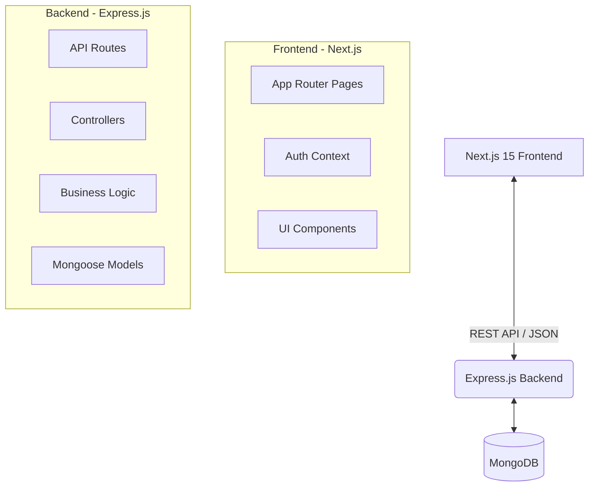
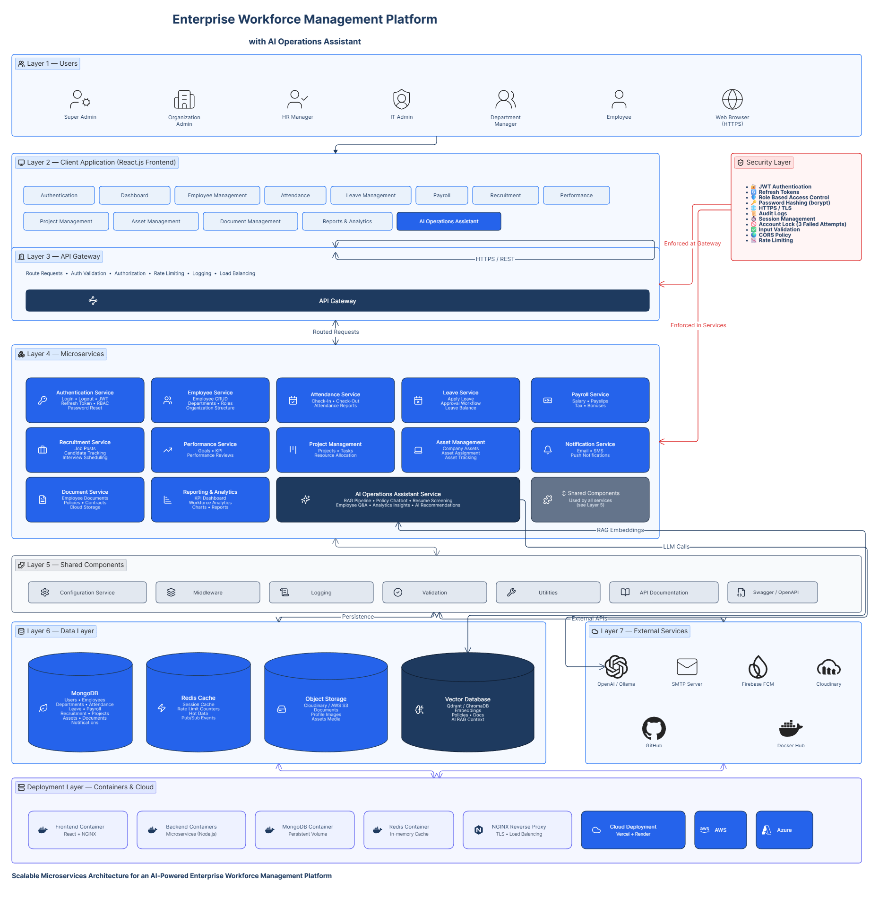
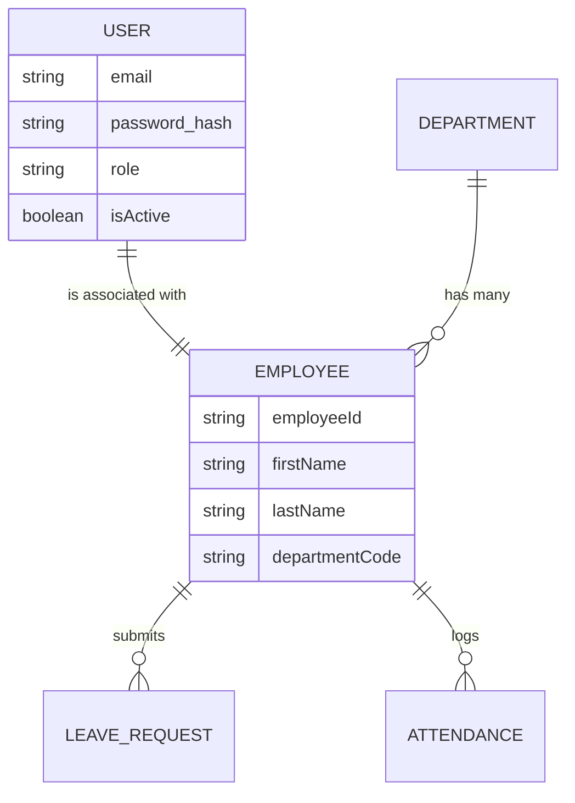
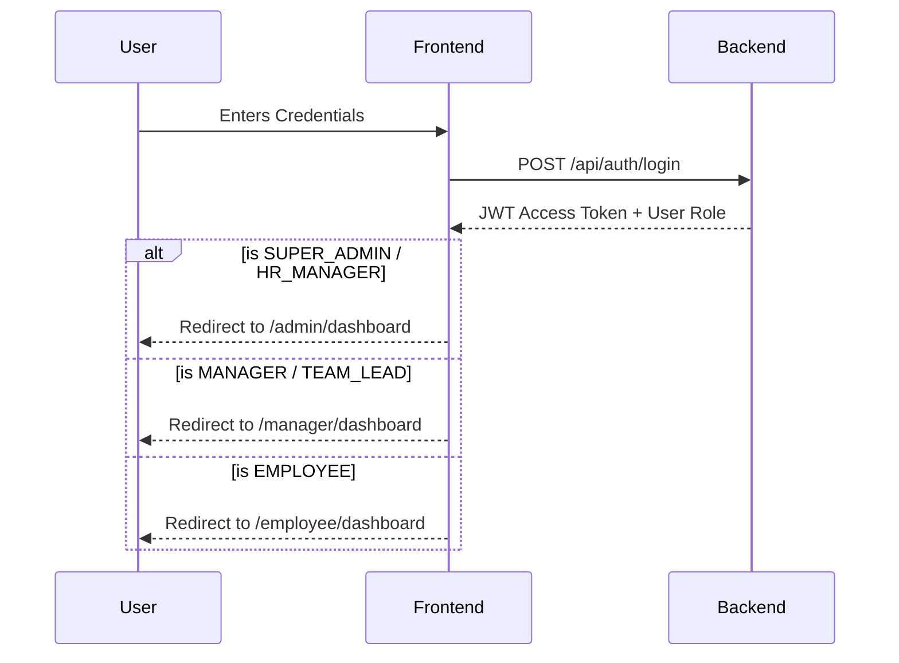

# Enterprise Workforce Management Platform
**The Official Project Bible**

Welcome to the definitive documentation for the NexForce Enterprise Workforce Management Platform.

---

## 1. Executive Summary

NexForce is an ultra-premium, AI-powered workforce management platform designed for modern enterprises. It provides comprehensive tools for human resources, department managers, and employees to seamlessly manage operations.

**Key Highlights:**
- **Next.js 15 App Router** frontend with Vercel-style minimalist light theme.
- **Express.js & MongoDB** backend with robust role-based access control (RBAC).
- **Interactive Dashboards** offering real-time insights into workforce analytics.

---

## 2. System Architecture

The platform follows a decoupled client-server architecture.

### Architecture Diagram


*(Note: The diagram above illustrates the separation of concerns and data flow.)*

---

## 3. Database Schema Reference

The core entities are highly relational despite being stored in a NoSQL database (MongoDB).



### Schema Overview


---

## 4. Role-Based Access Control (RBAC)

The system supports multiple distinct roles, each with its own dashboard and feature flags.

### Role Hierarchy & Redirects


### Role Descriptions
1. **SUPER_ADMIN**: Full system access, can configure global settings.
2. **HR_MANAGER**: Can create employees, approve leaves across departments.
3. **MANAGER**: Can view team performance and approve team leaves.
4. **TEAM_LEAD**: Manages daily attendance and task tracking.
5. **EMPLOYEE**: Restricted to their own profile, payslips, and leave requests.

---

## 5. UI/UX Design System

The platform recently underwent a massive pivot from a dark glassmorphism UI to a **Vercel-level Minimalist Light Theme**.

- **Typography**: Inter (Body), Space Grotesk (Display)
- **Backgrounds**: Stark Whites (`#FFFFFF`) to Off-White (`#FAFAFA`)
- **Borders**: Micro-borders (`rgba(0,0,0,0.1)`) instead of heavy shadows.
- **Accents**: Deep indigo and stark black for high contrast readability.

---

## 6. Local Development Guide

### Frontend
```bash
cd frontend-next
npm install
npm run dev # Starts on http://localhost:3000
```

### Backend
```bash
cd backend
npm install
npm run dev # Starts on http://localhost:5000
```

> **Demo Credentials:**
> - Admin: `superadmin@ewm.edu`
> - HR: `hr@ewm.edu`
> - Employee: `employee@ewm.edu`
> - Password: `DemoPass@123`

---
*Generated by the AI Operations Assistant on 2026-07-02.*
